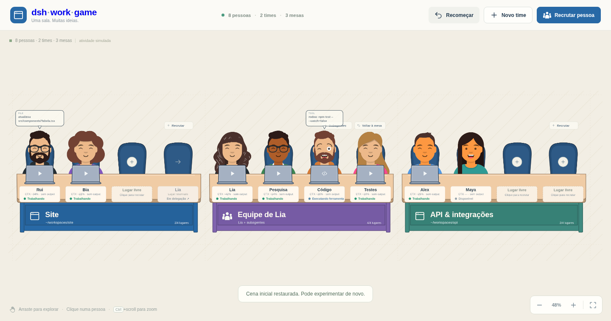
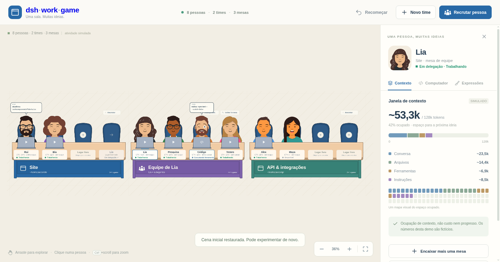

# dsh-work-game — o escritório 2D dos seus agentes

**Front-end puro em HTML, CSS, JavaScript e SVG — zero dependências, zero build, zero backend.** Uma sala onde times de agentes trabalham lado a lado, com mesas modulares, balões de output e expressões que mudam com o estado de cada pessoa. Duas formas de a ver: a **demo** (tudo simulado em memória) e o **Modo jogo** dentro do DeepSeek Harness (DSH), com as conversas e os workspaces reais.



## O que é

**dsh-work-game** visualiza um "escritório 2D" de agentes: uma única sala com as mesas de todos os times, pessoas sentadas, balões de output e painéis de contexto. Existe para mostrar como *parece* um time de agentes a trabalhar lado a lado — e para ser divertido de olhar.

- **A demo** ([index.html](index.html)) é uma demonstração visual: nomes, avatares, tarefas, linhas de output, ocupação de contexto e delegações são gerados e mantidos em memória, no navegador.
- **O plugin do DSH** ([dsh-plugin/](dsh-plugin/)) põe a mesma sala dentro da UI web do DSH, no botão **Modo jogo** do pé da barra lateral: cada **workspace** vira uma mesa e cada **conversa** vira uma pessoa, com a telemetria real do harness (ver [Plugin do DSH — Modo jogo](#plugin-do-dsh--modo-jogo)).

## O que não é

Para não criar expectativas erradas:

- **A demo não tem backend**, não executa agentes reais e não faz chamadas externas em runtime: nenhuma tarefa é enviada, nenhum modelo é chamado e nada é persistido.
- **O plugin não inventa nada nem age sozinho**: só mostra o que o DSH publica e só mexe no DSH quando você clica em **Abrir conversa** ou **Nova sessão** (as mesmas ações da barra lateral do DSH).

### Fidelidade ao DSH — a UI adapta-se ao harness, nunca o contrário

- **Nova sessão** e **Enviar tarefa** existem porque o DSH suporta essas ações de verdade.
- **Ninguém é movido à mão.** Uma pessoa só vai para a mesa de equipe quando a sessão **realmente chama subagentes** (`subagent/start`), e volta quando a delegação termina (`subagent/end`).
- Estados, expressões, balões, contexto e custo derivam sempre de eventos reais. O **Simulador de eventos DSH** existe só na demo offline e injeta exatamente os eventos que o harness emite — para você ver a cena responder sem inventar interações impossíveis.

## LEI de animação — vale para TODAS as animações

> **Lei de desenvolvimento** (decisão do utilizador, 2026-09-29): **toda** e qualquer animação —
> nova ou existente, demo ou plugin — segue estas regras. É a forma de mexer na cena sem "travar"
> nem forçar *repainting*. Detalhes técnicos em [docs/contratos-plugin.md](docs/contratos-plugin.md)
> ("Desempenho de animação") e na memória CoALA (`proj/lei/animacoes`).

1. **Só `transform` e `opacity` animam** — `translate`/`scale`/`rotate` e mais nada. Nunca
   `top`/`left`/`width`/`height`/`margin`/`padding`, nunca atributos SVG (`x`, `y`, `cx`…) por frame.
   (O único paint permitido é o feedback de cor em hover/click — `fill`/`stroke`/`background` — por
   ser curto e pontual; nada de loops fora de `transform`/`opacity`.)
2. **Só o que está visível anima** — fora da câmara ou debaixo do celular/barra: sem animação.
   Na demo, balão/portátil/fade nem se criam sem a pessoa no ecrã; no plugin, mesas `wg-fora` e
   lugares `wg-tapado` ficam com `animation:none`.
3. **Aba escondida = tudo em pausa** — não se vê nada, nada anima (`html.oculto` / `.wg-painel.wg-oculto`).
4. **`will-change` é gerido, nunca fixo** — a camada GPU existe só durante o gesto da câmara.
5. **`prefers-reduced-motion` desliga o movimento** — e as animações WAAPI (`element.animate`) levam
   gate manual, porque não herdam a media query do CSS.
6. **A câmara não reconstrói nada** — mover a vista escreve só `transform`; o markup do SVG é
   memoizado por estado, nunca reavaliado por frame.
7. **As regras de ouro mandam por cima de tudo**: os SVGs e o layout da demo não se tocam; mudar
   curvas/ritmos/efeitos é decisão do utilizador, nunca "limpeza de código".

## Como experimentar

- **Enquadrar a sala** — arraste o fundo para dar *pan*; use `+`, `−`, **Enquadrar**, `Ctrl` + scroll e as setas do teclado para o zoom. A sala é uma só: todas as mesas de todos os times numa grade de 3 colunas que continua para baixo, linha após linha.
- **Criar um time** — o diálogo **Novo time** pede nome, caminho visual e cor da mesa. O time nasce com uma mesa principal e lugares vazios.
- **Recrutar uma pessoa** — **Recrutar pessoa** sorteia nome e avatar **do mesmo gênero** (o gênero do boneco bate sempre com o gênero do nome) e sem repetir quem já está na sala; **Sortear outro** refaz o sorteio, e você escolhe o time de destino.
- **Crescer o escritório** — cada mesa tem exatamente 4 lugares. Quando todos os lugares do time estão ocupados e você adiciona mais uma pessoa, nasce uma nova mesa ao lado da mesa principal do time e as mesas seguintes (inclusive a de equipe) são empurradas para a direita, abrindo mais 4 lugares.
- **Ler os balões de output** — a última saída de cada pessoa aparece como balão acima da cabeça: somente a mais nova substitui a anterior, ela fica 1 segundo e some com animação de entrada e saída.
- **Abrir o painel de uma pessoa** — clique nela para ver o visualizador de contexto (janela de tokens simulada, com composição e mapa) e a aba **Computador** (tarefa simulada, atividade e controles de estado visual).
- **Ver quanto cada agente gasta** — cada ficha traz `CTX ~22% · US$ 0,09 · 38 tok/s`; o painel detalha os 4 buckets de tokens (`entrada`, `saída`, `cache de leitura`, `cache de escrita`), o gasto acumulado, a velocidade de tokens, o pico de contexto e o modelo (a troca de modelo recalcula a janela e o preço). Cada mesa também mostra o gasto total dos seus lugares.
- **Acompanhar o contexto com aviso de 200k** — quando alguém passa de **200k de contexto**, a ficha ganha um marcador ⚠, o rótulo acessível avisa e o painel mostra o banner "compactação recomendada".
- **Responder perguntas** — quem pergunta recebe um **sinalizador ❓ sobre a cabeça**; ao clicar, a pergunta abre **embaixo da tela** com as opções, um campo de resposta livre, **o boneco e o nome de quem perguntou embaixo**, e um **sombreado sobre o resto da tela**. "Responder depois" não responde; cancelar é uma ação explícita.
- **Ver quem terminou** — o fim de turno aparece com uma **fita verde "Concluído · resultado pronto"** na ficha (e variantes para interrompido, erro, bloqueado e máx. tokens), além de ficar registado na aba **Atividade**. Uma tarefa nova aposenta o sinal.
- **Montar a pilha de papéis** — mais uma tarefa entra na fila como um **papel na mesa**, acumulando em cima. Clicar na pilha abre os prompts: **editáveis enquanto não forem submetidos**, com **Submeter agora** por papel e mais um campo para empilhar outro.
- **Consultar o Arquivo** — quem é eliminado sai da sala mas fica no **Arquivo** do cabeçalho, com gastos, tokens, pico de contexto, ações e papéis preservados (incluindo subagentes recolhidos no fim de uma delegação).
- **Ver as ações em tempo real** — o painel **Ações em tempo real** mostra cada evento assim que acontece (com hora e quem fez); clicar numa ação abre a pessoa. A aba **Atividade** traz o mesmo histórico por pessoa.
- **Testar expressões ao vivo** — o painel permite trocar a expressão e conferir cada preset no rosto da pessoa.
- **Montar uma equipe** — o diálogo **Montar equipe** pergunta quantos subagentes você quer. O coordenador sai da cadeira original (que fica reservada, sem duplicar o avatar) e vai para a mesa de equipe encostada, onde os subagentes ocupam os outros lugares. Ao retornar, a mesa de equipe recolhe e os resultados ficam registrados na demo.
- **Recomeçar demo** — o botão do cabeçalho restaura o exemplo inicial.

O painel de contexto — números fictícios, sempre rotulados como simulados:



O cabeçalho global traz a marca e as ações **Novo time**, **Recrutar pessoa**, **Recomeçar demo**, o contador **N a aguardar de ti** (perguntas pendentes) e o **Arquivo** dos eliminados. Não há sidebar lateral nem cabeçalho por sala.

## Como rodar

Na pasta do projeto:

```bash
python3 -m http.server 4173 --bind 127.0.0.1
```

Abra **http://127.0.0.1:4173**. É só isso: sem `npm install`, sem build, sem chave de API.

Use HTTP local em vez de abrir o `index.html` por `file://` — navegadores restringem referências entre arquivos SVG nesse modo e partes da cena não carregam.

## Plugin do DSH — Modo jogo

O plugin ([dsh-plugin/](dsh-plugin/)) é um bundle Cordis para a UI web do DSH (testado na `0.1.6-alpha.2`). Instale-o **diretamente do GitHub**:

```bash
dsh plugin --profile web add https://github.com/frederico-kluser/dsh-work-game
dsh --profile web          # ou deixe o que já está a correr: o client-hmr recarrega o plugin
```

Para desenvolvimento local, use **link** para o DSH servir sempre o código atual do repositório (serve a raiz ou `dsh-plugin/`):

```bash
dsh plugin --profile web add link:/caminho/para/dsh-work-game
```

> Instalar com `file:` faz uma **cópia** congelada no perfil (`~/.dsh/profiles/web/node_modules`): o DSH passa a servir essa cópia antiga mesmo depois de o repositório mudar — foi exatamente o que deixou bonecos e workspaces a faltar. Com `link:` não há cópia.

No **Modo jogo** (pé da barra lateral, ao lado de Settings) a sala mostra:

- **Uma mesa por workspace do DSH**, na ordem do DSH, com o título e o caminho — as cores alternam azul/verde/coral como na demo. Cada conversa senta-se na mesa do workspace que a reclama (a mesma regra da barra lateral); as conversas sem workspace vão para **Sem workspace** (o *Ungrouped* do DSH). Um workspace vazio aparece com os seus 4 lugares livres. Sem o serviço de workspaces, a sala agrupa por pasta.
- **Uma pessoa por conversa visível**: subagentes, conversas arquivadas e conversas ainda em branco não têm lugar próprio — como na barra do DSH. Cada pessoa tem um nome curto e um boneco Avataaars estáveis (guardados no navegador, derivados do id da conversa — e **do mesmo gênero**: um "Rui" nunca ganha boneco de mulher); o título da conversa aparece no tooltip e na barra lateral.
- **Filtros** (botão **Filtros ▾** da barra de cima, guardados no navegador): **Mostrar arquivadas** (desligado; ligado, elas sentam-se na mesa do seu workspace com a ficha **Arquivada** em cinzento), **Mostrar "Sem workspace"** (ligado), **Só quem está a trabalhar** (desligado; esconde também as mesas sem ninguém a trabalhar) e **Mostrar conversas em branco** (desligado). Ao lado, um aviso diz quantas conversas os filtros estão a esconder ("3 escondidas pelos filtros").
- **Partilhar (link + QR code)** — **só no desktop** (botão **Partilhar ▾** da barra de cima, ao lado de Filtros): gera um link público no seu domínio (Cloudflare Tunnel — funcionalidade da `cloudflare-agent-skill` **embutida no plugin**, em [dsh-plugin/expose-port/](dsh-plugin/expose-port/), sem depender de skills instaladas na máquina) com **QR code** para alguém abrir o Modo jogo — o link abre já no escritório (âncora `#jogo`) e **fica online até carregar em "Fechar a ação"**, que derruba o host. O alvo publicado é a própria UI do DSH com o token de sessão construído **no lado host** (nunca pelo browser), num host efémero `jogo.<domínio>` (as rotas permanentes como `kluser.me` não são tocadas); em telemóvel o botão não aparece. No mesmo painel, e atrás de confirmação em dois cliques, **"Encerrar o Cloudflare"** derruba **tudo** o que a máquina publica (a partilha e as restantes rotas, incluindo `kluser.me`) e para o túnel — nada é apagado da conta e reativa-se voltando a publicar. **Aviso no painel**: quem tem o link acede à UI do DSH nesse computador — partilhe só com quem confia.
- **Barra lateral da pessoa** (a mesma da demo, "UMA PESSOA, MUITAS IDEIAS"): clicar numa pessoa abre-a à direita com o avatar, o workspace e a mesa, o estado e a conversa (**Conversa**, **Abrir no DSH**). Os separadores mostram só dados reais: **Contexto** (janela usada / total, com o aviso acima de 200k), **Custo** (os 4 tipos de tokens do DSH com o custo estimado pela tabela do plugin, modelo e velocidade) e **Atividade** (o histórico da conversa — os pedidos, as ferramentas usadas ✓/✕, as respostas e os erros, cada um com a hora — intercalado com os eventos que chegam ao vivo; continua lá depois de fechar o celular). `Esc` ou ✕ fecham-na; a sala encolhe para caber ao lado, sem descer do zoom legível, e a pessoa fica centrada à vista.
- **Celular com a conversa** (estilo iMessage): clicar numa pessoa abre também um iPhone a flutuar sobre a sala, à esquerda da barra lateral, com a conversa **real** dela — as minhas mensagens à direita em azul, as do agente à esquerda em cinza, agrupadas com a "cauda" na última, a hora entre blocos, **Entregue** sob a última minha, as ferramentas resumidas numa linha cinzenta ("🔧 bash · npm test", clique para ver todas) e os três pontos **a escrever…** enquanto o agente trabalha. O Markdown das respostas aparece limpo: títulos e **negrito**, listas, código, e as tabelas como "coluna · coluna" (sem pipes). Por baixo, a caixa **iMessage** envia um prompt novo para essa conversa (`Enter` envia, `Shift+Enter` muda de linha; vazia, mostra o microfone, como no iPhone); se o agente estiver a trabalhar, a mensagem fica **na fila** — no fim da conversa, **sempre como última mensagem** (debaixo até do "a escrever…", como a QueueDock do DSH), com o recibo dela ("na fila" · "a entrar no turno…") e os botões **Enviar agora** (entra já no turno em curso) e **Remover**; sem carregar em nenhum, ela entra sozinha quando o turno terminar (FIFO, como no DSH); se o envio falhar, aparece **Não entregue** (clique no ❗ para tentar de novo); se a conversa não abrir, a caixa fica desativada. Ao subir até ao topo carregam-se as mensagens anteriores. **‹ Escritório**, `Esc` ou **Conversa** fecham-no; ao fechar (ou trocar de pessoa, ou sair do Modo jogo) o plugin larga a conversa — nada fica preso em fundo. Com o painel estreito (portátil pequeno, barra do DSH aberta), o celular abre por cima da barra lateral para a sala não ficar tapada.
- **Estado real**: quem está a correr aparece **Trabalhando**; os outros, **Disponível**. A ficha traz contexto (`CTX`), custo estimado e velocidade de tokens a partir das projeções do DSH (sem dado, mostra `—`).
- **Quem está Disponível dorme**: olhos fechados ([assets/avatars/sleeping/](assets/avatars/sleeping/)), a cabeça a balançar **lateralmente** e um "zzz" a subir junto à cabeça (igual no Chrome, Brave e Safari); quem pergunta, erra ou concluiu mantém a expressão da demo.
- **Quem trabalha balança**: o boneco sobe e desce levemente; quem dorme balança a cabeça para o lado, com a **mesma velocidade e distância** do balanço de quem trabalha (as mesmas 7 unidades, o mesmo ciclo de cosseno, no eixo X). **Ninguém se move igual a ninguém**: cada pessoa tem a sua velocidade (0,82×–1,30× do ciclo base) e o seu próprio começo de animação — a mesma conversa tem sempre o mesmo ritmo, em qualquer browser, e a cena nunca salta quando se atualiza. `prefers-reduced-motion` desliga o movimento. Os balanços e o "zzz" andam em pequenos degraus (5 por segundo, no mesmo relógio): a sala parada não fica a gastar CPU. Toda a animação é `transform`/`opacity`/`filter` (MotionScore S, regras Motion): só o que está à vista anima (fora da câmara ou debaixo do celular, `animation:none`), com a aba escondida tudo entra em pausa e a camada GPU do mundo (`will-change`) só existe durante o gesto da câmara.
- **As expressões acontecem durante o trabalho**: os eventos reais da conversa — cada mensagem (pedidos e respostas), **executar uma ferramenta**, um **erro** e o fim do turno — disparam **sorteios de expressões** da biblioteca ([expressions.js](expressions.js), [dsh-plugin/src/variantes.js](dsh-plugin/src/variantes.js), [assets/AVATARS-EXPRESSIONS.md](assets/AVATARS-EXPRESSIONS.md)): cada evento tem o seu **pool de variantes** (ferramenta → `tool · searching · focused · thinking`; erro → `error · surprised · disbelief`; trabalho → `working · focused · thinking · searching · wink`; sucesso → `success · celebrating · approval · wink`) e **cada pessoa tem o seu disparo aleatório** — probabilidade e personalidade próprias, com anti-repetição (nunca repete a cara atual). As variantes **TODAS** da biblioteca podem aparecer; os estados fortes (dormir, ferramenta, espera, erro, sucesso) mandam na cara enquanto durarem. As mensagens observam-se com uma referência leve por conversa **a correr** (a mesma receita do celular), libertada quando a conversa pára: nada fica preso em fundo.
- **Grupos (workspaces) no celular**: para além da conversa individual, o celular tem os **Grupos** — um por workspace da sala (o "Messages" do nosso iMessage). O grupo mostra **todos daquele workspace a falar e a escrever**: as mensagens de cada um com o nome de quem fala, as ferramentas numa linha e quem está a correr com "está a escrever…". Clicar numa mensagem (ou em quem escreve) abre a **conversa individual** dessa pessoa; o "‹" sobe a pilha (conversa → grupo → grupos) e na raiz fecha ("‹ Escritório"). No grupo não há ícone de ligar e escrever é à pessoa (abre a conversa dela).
- **Celular: ligar e microfone**: o ícone de câmara do FaceTime foi substituído pelo de **ligar** (só nas conversas individuais; decorativo — chamadas são no DSH) e o "+" dos anexos ao lado do campo virou **microfone** (voz é no DSH; sem duplicados na cápsula).
- **Modo telemóvel (responsivo)**: quando um telemóvel abre o site, o Modo jogo é **SÓ o celular em fullscreen** — por cima de tudo o que é do DSH (a barra não se vê), sem escritório, sem animações de fundo e sem moldura (Dynamic Island/barra de casa fora). Navega-se **só dentro do celular** e a única saída é o botão **✕ Fechar** da **tela inicial** (a lista de Grupos) — que fecha o Modo jogo e volta à Conversa do DSH.
- **Portátil junto ao peito**: o tampo fica logo abaixo do queixo, virado para a pessoa, sem tapar olhos nem boca.
- **Cenário**: o topo da sala é a parede do escritório — forro ripado, janela grande à esquerda com cortinas, figueira, quadros, relógio e estante ([assets/office-backdrop.svg](assets/office-backdrop.svg)); as mesas ficam no chão, logo abaixo do rodapé. A sala encosta ao topo (a parede cola à barra de cima) e o chão continua até ao fundo do painel.
- **Delegação em curso**: quando uma conversa corre subagentes, ela senta-se na **mesa violeta "Equipe de …"** com eles e o lugar de casa fica **reservado** ("Em delegação ↗").
- **Ações reais**: o celular envia prompts à conversa; na barra lateral, **Abrir no DSH** mostra a conversa no DSH; **Nova sessão** e os **lugares livres** de uma mesa abrem uma conversa nova naquele workspace. **Parar pessoa e equipa** (botão da barra lateral, enquanto há trabalho a correr ou equipa em curso) é a paragem em cascata que o DSH não tem: interrompe o turno da pessoa **e de TODA a sua subárvore de subagentes** (pai primeiro) e larga as tarefas na fila de cada um — sem largar a fila, o próprio DSH retoma as tarefas pendentes logo após a interrupção. Arrastar explora a sala; `Ctrl` + scroll faz zoom.
- **Câmara**: ao abrir, a sala enquadra-se sozinha; numa sala grande (dezenas de mesas) mostra a largura inteira a partir do topo — os workspaces primeiro, com bonecos legíveis — em vez de encolher tudo. O zoom automático nunca desce abaixo do legível (40%): com a barra lateral aberta, a pessoa selecionada fica centrada na parte da sala que se vê (à esquerda do celular). Depois de arrastar ou dar zoom, a câmara fica onde a deixou; **⤢ Enquadrar** mostra a sala inteira.

Validar num DSH web real (Chrome, Chromium ou Brave via `CHROME_PATH`):

```bash
node scripts/verify-dsh-panel.mjs "http://127.0.0.1:<porta>/?token=<token>" [pasta] [--acoes] [--recrutar] [--conversa] [--grupos] [--enviar "<regex do título>"]
```

O verificador abre o painel e confirma workspaces → mesas, bonecos desenhados (cada `<use>` com o seu `<symbol>`, sem referências partidas), que o "zzz" sobe junto à cabeça (sonda de geometria), a barra lateral e os seus três separadores (com a câmara legível e a Atividade com o histórico da conversa), o menu de filtros (e que o filtro de arquivadas mexe na sala e fica guardado), clique/arraste com rato real e zero erros de consola. `--conversa` abre o celular em cada pessoa e exige bolhas reais (cores do iMessage, cauda, hora), fecha-o e troca de pessoa sem deixar a conversa presa; `--grupos` valida os GRUPOS do celular (lista de workspaces → feed de todos a falar → clique abre a conversa individual), o ícone de ligar (só nas conversas), o microfone no lugar do "+" e o modo TELEMÓVEL (só o celular, sem moldura e sem fechar); `--enviar` escreve e envia uma mensagem curta pelo celular na conversa cujo título casa com a regex e espera a resposta do agente, e valida também a **fila** (padrão do DSH): com o agente a correr, a mensagem seguinte fica **sempre como última mensagem**, com **Enviar agora** (steer para o turno em curso) e **Remover** (gasta tokens — use uma conversa de teste). Os contratos e as fontes verificadas no código do DSH estão em [docs/contratos-plugin.md](docs/contratos-plugin.md) e [docs/integracao-dsh.md](docs/integracao-dsh.md).

A **paragem em cascata** tem o seu próprio e2e com trabalho real (`scripts/e2e-paragem.mjs <url> <pasta> "<regex do título>"`): cria uma equipa de subagentes pelo celular, manda tarefas adicionais por mensagem ao líder e a um subagente, carrega em **Parar pessoa e equipa** a meio e exige que o plano cubra a subárvore toda, que as filas fiquem largadas e que **ninguém — nem os subagentes — continue "Trabalhando"** (é exatamente aí que o DSH sozinho falha: `cancel()`/`interrupt_agent` param só o alvo e a fila pendente retoma sozinha).

A **partilha (link + QR code)** também tem verificador próprio (`node scripts/verify-partilha.mjs <url-de-um-dsh-web> [pasta] [--encerrar]`): clica em **Partilhar ▾**, gera o link com QR, exige que o link esteja **online de verdade** pela edge (303 = troca do token por cookie), clica em **Fechar a ação** e exige que o mesmo URL passe a **404** — e que em modo telemóvel o botão **não** apareça. Publica e derruba um link real e fica sempre fechado no fim. `--encerrar` testa ainda o botão destrutivo **"Encerrar o Cloudflare"** (confirmação em dois cliques; todos os hosts da nota final têm de responder 404) — **atenção: derruba TODAS as rotas Cloudflare da máquina e não as repõe**.

## Estrutura do repositório

- [index.html](index.html), [styles.css](styles.css) e [app.js](app.js) — o app completo, sem build.
- [package.json](package.json) — conveniência: `npm test` e `npm start`, sem qualquer dependência.
- [data.js](data.js) — nomes e frases simuladas.
- [expressions.js](expressions.js) — presets de expressão (enums do Avataaars) e resolução dos assets.
- [tests/](tests/) — suíte de testes (funcionais em Chrome headless + estáticos/contratos) com helpers sem dependências.
- [dsh-plugin/](dsh-plugin/) — o plugin do DSH: [client.js](dsh-plugin/src/client.js) (bundle do browser: sala, estado e painel), [surface.js](dsh-plugin/src/surface.js) (a ponte com as sessões e os workspaces reais, embutida no bundle), [index.js](dsh-plugin/src/index.js) (entry host: a rota `/api` da partilha, link + QR) e o manifesto em [package.json](dsh-plugin/package.json).
- [scripts/verify-dsh-panel.mjs](scripts/verify-dsh-panel.mjs) — verificador do Modo jogo num DSH web real, com capturas de evidência.
- [scripts/verify-partilha.mjs](scripts/verify-partilha.mjs) — verificador da partilha (link + QR, online até "Fechar a ação", só desktop) num DSH web real.
- [scripts/e2e-paragem.mjs](scripts/e2e-paragem.mjs) — e2e da paragem em cascata com agentes reais (criar equipa, tarefas adicionais por mensagem, parar a meio).
- [scripts/demo-session.mjs](scripts/demo-session.mjs) — sessão simulada de ponta a ponta (tarefas, pergunta, pilha de papéis, fim de turno, aviso de 200k e Arquivo) com capturas de evidência: `node scripts/demo-session.mjs`.
- [scripts/embutir-expressoes.py](scripts/embutir-expressoes.py) — FONTE dos corpos de expressão embutidos no plugin: `python3 scripts/embutir-expressoes.py --embutir` (idempotente; `--verificar` confere sem escrever).
- [docs/conhecimento/](docs/conhecimento/) — dossiês do projeto: decisões, arquitetura, pipeline de avatares, design, qualidade, publicação e as features futuras especificadas.
- [AGENTS.md](AGENTS.md) — bloco que liga os agentes à memória CoALA local do projeto.
- [assets/furniture.svg](assets/furniture.svg) — móveis e ícones SVG reutilizáveis.
- [assets/desk-module.svg](assets/desk-module.svg) — módulo de mesa independente, com 4 cadeiras.
- [assets/avatars/](assets/avatars/) — as 8 identidades nomeadas de avatar, em SVG.
- [assets/avatars/expressions/](assets/avatars/expressions/) e [assets/avatars/random/](assets/avatars/random/) — variantes de expressão por identidade e identidades aleatórias.
- [assets/AVATARS-SOURCES.md](assets/AVATARS-SOURCES.md), [assets/AVATARS-EXPRESSIONS.md](assets/AVATARS-EXPRESSIONS.md) e [assets/AVATAARS-LICENSE.txt](assets/AVATAARS-LICENSE.txt) — proveniência e licença dos avatares.
- [demo-preview.png](demo-preview.png) e [demo-contexto.png](demo-contexto.png) — capturas da demo.
- [LICENSE](LICENSE) e [THIRD_PARTY_NOTICES.md](THIRD_PARTY_NOTICES.md) — MIT para o código e atribuições de terceiros.

## Arquitetura: uma sala, módulos SVG

A cena é montada a partir de módulos SVG numa grade de **3 colunas × linhas infinitas**. Cada time ocupa uma sequência contígua de módulos — mesa principal, mesas de expansão e, havendo delegação, a mesa de equipe — avançando da esquerda para a direita; quando a linha enche, a sequência continua na linha seguinte.

- **Módulo de mesa.** Cada mesa tem exatamente 4 cadeiras e ocupa um *pitch* de **900 unidades** horizontais. Crescer é repetir o mesmo símbolo deslocado em `900 × índice` — nenhuma mesa anterior precisa ser redesenhada.
- **Cor por variáveis CSS.** As variáveis de cor (`--desk-color`, `--desk-panel`, `--desk-stroke`) parametrizam a aparência das mesas por time: mudar a paleta é mudar um valor, não um desenho.
- **SVG reutilizável.** Móveis, cadeiras, notebooks e ícones vivem em [assets/furniture.svg](assets/furniture.svg) e são referenciados por `<use>`; o [módulo de mesa](assets/desk-module.svg) também funciona sozinho.

## Expressões com os enums do Avataaars

Cada pessoa muda de rosto conforme o estado — disponível, trabalhando, *tool call*, sucesso, erro, espera de aprovação e outros. Os presets são descritos com os **enums reais da biblioteca Avataaars** (`eyeType`, `eyebrowType`, `mouthType`) e materializados como **variantes SVG locais por identidade**: cada pessoa tem suas próprias expressões, sem depender de rede.

O painel lateral traz um teste de expressões ao vivo: escolha um preset e veja o rosto mudar na hora. Os detalhes das variantes estão em [assets/AVATARS-EXPRESSIONS.md](assets/AVATARS-EXPRESSIONS.md).

## Dados simulados e limitações

- Tudo é simulado em memória: nomes, avatares, tarefas, ocupação de contexto e resultados de delegação. Um pequeno motor de atividade emite linhas de output (arquivos, ferramentas, testes, resultados) para dar vida à cena.
- Os números do visualizador de contexto são **fictícios e rotulados como simulados** no próprio painel; não representam consumo real de tokens.
- **Gasto, velocidade de tokens, custo por mesa e custo por bucket são estimativas simuladas** (tabela de preços própria, rotulada no painel). Os buckets seguem o vocabulário real do DSH (`input` não-cacheado, `output`, `cacheRead`, `cacheWrite`) para a migração futura ser direta — mas nada é cobrado.
- Nome e avatar são aleatórios, mas **do mesmo gênero** (nomes neutros como "Alex" servem para qualquer boneco): não há conceito de cargo ou função.
- Nada é persistido — recarregar a página ou clicar em **Recomeçar demo** restaura o exemplo (inclusive o Arquivo e o feed).
- Todos os assets são locais: nenhuma chamada externa em runtime.

## Testes

A suíte cobre **todas as funcionalidades** — não linhas de código: cada comportamento visível da demo tem pelo menos um teste. Sem dependências npm: usa o runner nativo do Node e Chrome/Chromium headless via CDP.

```bash
node --test 'tests/**/*.test.mjs'   # ou: npm test
```

- **`tests/functional.test.mjs`** — 20 testes funcionais contra a página real: arranque e cena-semente; ausência de sidebar/cabeçalho de sala; fichas sem cargo; seleção e inspetor; contexto simulado (`~`, `CTX —`, mapa); computador e primeira tarefa; os 6 estados com rótulo/ícone/marcador; os 14 presets de expressão com troca real do rosto; recrutamento aleatório com "Sortear outro" e gênero do boneco a casar com o nome; crescimento de mesa com empurrão da mesa de equipe; criação de time; delegação com cadeira reservada e sem avatar duplicado; retorno com resultados preservados; balões (substituição e expiração ~1s); câmera (zoom, enquadrar, arraste, teclado, sem scroll nativo); recomeçar demo; mobile 390×844; e offline (zero requisições externas e zero erros de consola).
- **`tests/features.test.mjs`** — 7 testes das features de telemetria e pipeline: gasto/velocidade por agente e acumulação real do contador; aviso de contexto acima de 200k (cena + painel + rótulo acessível); pergunta (sinalizador → sheet com opções, input, quem perguntou embaixo e sombreado; responder/cancelar/responder depois); fim de turno (fita de conclusão, razões de `turn/end`, aposentadoria do sinal); pilha de papéis (fila editável, submeter agora, remover); Arquivo de eliminados (histórico preservado, inclusive subagentes recolhidos); e feed de ações em tempo real.
- **`tests/static-assets.test.mjs`** e **`tests/contracts.test.mjs`** — validação dos 180 SVGs de `assets/` (os 160 avatares de expressão/aleatórios, os 8 bustos, os 8 a dormir e os 4 da raiz, incluindo o cenário do escritório — XML, viewBox, sem scripts/recursos externos), contratos de `data.js` e `expressions.js` (incluindo os enums reais do Avataaars, a cadeia de fallback e as **regras de gênero**: `nameGenders` cobre todos os nomes, femininas sem barba/bigode, sem chapéus/bonés repetidos, sem óculos de lente opaca), estrutura do `index.html` e links do README.
- **`tests/lei-animacao.test.mjs`** — a **LEI de animação** imposta por teste (7 verificações): todos os `@keyframes` animam só `transform`/`opacity` (demo e plugin), transições dentro do permitido, WAAPI só em `transform`/`opacity` e com gates de `prefers-reduced-motion` e visibilidade, `will-change` sempre gerido, aba escondida em pausa e portões de visibilidade dos dois lados. **Qualquer animação nova fora da lei reprova logo aqui.**
- **`tests/plugin/`** — o plugin do DSH: a ponte com sessões e workspaces (deltas de uso, delegação só com subagentes a correr, ligação tardia aos workspaces e paridade bundle ↔ `surface.js`), a distribuição pela sala (uma mesa por workspace, visibilidade da barra do DSH, mesa de delegação, cada filtro com a contagem de escondidas e a persistência), a cena (geometria e cores da demo, bonecos por `<symbol>`, referências resolvidas e a arte byte a byte igual à da demo) e a barra lateral (tokens por tipo e linha do tempo por pessoa, e o modelo de dados que ela mostra); `telefone.test.mjs` cobre o celular com as formas reais do DSH (nós do chat → bolhas, grupos e cauda, horas, recibos, "a escrever…", limite do DOM) e o ciclo de vida da conversa retida (rótulo próprio, eco sem bolha dupla, envio em fila, "Não entregue", libertar sempre e uma só vez), as tabelas do Markdown, o histórico da conversa na Atividade e que reabrir o painel não ressuscita conversas apagadas; `paragem.test.mjs` cobre a **paragem em cascata** (plano alvo + subárvore pai-primeiro, ciclos, paridade bundle ↔ `state.js`, fila largada antes do cancel, falhas isoladas e o botão da barra lateral).
- **`tests/helpers/`** — servidor HTTP estático e driver CDP, ambos apenas com stdlib do Node.

Para correr os testes funcionais é preciso um Chrome/Chromium no sistema (`CHROME_PATH` aponta para o executável quando não está no `PATH`).

### Regressivo com Playwright (opcional)

Uma segunda linha de regressão, em Playwright, corre as viagens centrais em **chromium e webkit** — o webkit apanha as armadilhas do Safari (animações CSS criadas só no cálculo de estilo seguinte, `transform-box`, `backdrop-filter`) — nas duas superfícies: a demo estática e o **Modo jogo** num DSH web real.

```bash
npm i --no-save playwright && npx playwright install chromium webkit
node scripts/regressivo-playwright.mjs --dsh "http://127.0.0.1:<porta>/?token=<token>"  # demo + Modo jogo
node scripts/regressivo-playwright.mjs --so-demo                                        # só a demo
```

Na demo: arranque com a cena-semente, zero requisições externas, inspetor com separadores e mobile 390×844 sem overflow. No Modo jogo: ativação do bundle, workspaces → mesas, bonecos com `<symbol>` resolvido e caixa real, "zzz" junto à cabeça, filtros (com persistência depois de recarregar), barra lateral com os três separadores, celular com bolhas iMessage e libertação da conversa (0 referências). Grava capturas e `relatorio.json`/`relatorio.md` em `logs/regressivo-*`. Exit codes: `0` verde · `1` reprovação · `2` uso inválido · `3` dependência em falta. O `npm test` continua sem dependências.

## Roadmap

1. **Frontend de demonstração** — a sala, as mesas, os balões, os painéis e as expressões, 100% simulados.
2. **Modo jogo no DSH** — feito: workspaces e conversas reais, estado a correr, contexto, custo, velocidade, delegação em curso e as ações Abrir conversa / Nova sessão.
3. **Eventos finos em tempo real** — ferramentas, perguntas, aprovações e fim de turno por conversa (os eventos de fio do DSH), para a sala ganhar os balões e as fitas que a demo já desenha.

## Licenças e créditos

- **Código**: [MIT](LICENSE).
- **Avataaars**: bustos e expressões baseados na biblioteca [Avataaars](https://github.com/fangpenlin/avataaars) — design original de **Pablo Stanley**, implementação de **Fang-Pen Lin** — sob licença MIT.
- **avataaars.io** foi usado apenas para baixar os SVGs durante o desenvolvimento; a demo não consulta o serviço em runtime.
- **Atribuições completas**: [THIRD_PARTY_NOTICES.md](THIRD_PARTY_NOTICES.md); proveniência dos avatares em [assets/AVATARS-SOURCES.md](assets/AVATARS-SOURCES.md) e [assets/AVATARS-EXPRESSIONS.md](assets/AVATARS-EXPRESSIONS.md).

## English summary

**dsh-work-game** is a pure front-end prototype (HTML, CSS, JavaScript and SVG — no dependencies, no build step) that renders a 2D "agent office": one single room where teams sit at modular 4-seat desks arranged in a 3-column grid with infinite rows. People are created with fully random names and Avataaars busts; a small simulated activity engine emits output lines shown as speech bubbles that are replaced only by the newest one and fade after a second; faces change with each person's state using the real Avataaars enums (`eyeType`, `eyebrowType`, `mouthType`) with local SVG variants per identity; clicking a person opens a side panel with a simulated token-context viewer (composition and map, numbers labelled as simulated), a computer tab and a live activity tab. Each person carries simulated telemetry — spend (four token buckets priced by model), token speed and context window with a >200k warning — shown on the seat card, the inspector and the desk total; a live action feed streams every event; an agent that asks a question gets a clickable ❓ flag that opens a bottom sheet with options, a free-text input, the asker's avatar and name below, and a shade over the rest of the screen; turn endings are explicit ribbons ("Concluído · resultado pronto" and variants for aborted/error/blocked/max-tokens); queued tasks stack up as paper piles on the desk, editable until "Submeter agora"; and eliminated agents keep their full history in the Arquivo. A coordinator can delegate to an attached team desk and return. In the demo everything is in-memory and simulated. The same room also ships as a DeepSeek Harness web plugin (`dsh-plugin/`, "Modo jogo" in the sidebar foot): every DSH workspace becomes a desk and every visible conversation a seated person, with real running state, context, estimated cost, token speed, a violet team desk while subagents run, and the real "open conversation" / "new session" actions — install it with `dsh plugin --profile web add https://github.com/frederico-kluser/dsh-work-game` (or `link:<repo>` for local development). Run the demo with `python3 -m http.server 4173 --bind 127.0.0.1` and open http://127.0.0.1:4173. Code is MIT-licensed; avatars come from the MIT-licensed Avataaars library by Pablo Stanley and Fang-Pen Lin.
